ESP32入門講座第1回:MH-ET LIVE MiniKit for ESP32をセットアップ方法(Windows版) 
# はじめに
航空研の新勧に参加してくれてありがとうございます。これから4回に分けてESP32(MH-ET LIVE MiniKit for ESP32)の基本的な機能を覚えて行きましょう。ESPやSTMマイコンなどを勉強するとドローン(マルチコプター)や缶サットを自由自在に制御できるようになります。この基礎講座で知識をコツコツ積み上げて行きましょう！

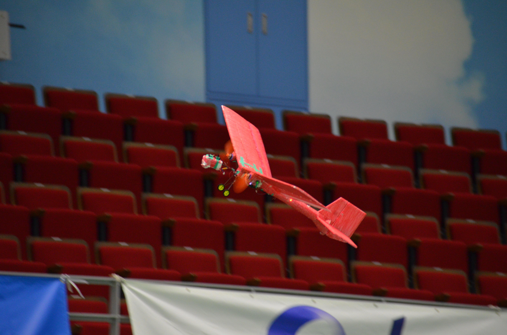

『第21回全日本学生室内飛行ロボットコンテスト自動操縦部門出場機体:山茶花』

マイコンの開発を行うためには統合開発環境(IDE)を整える必要があります。開発環境とは設計やコーディングを効率的に行える作業環境のことを指します。

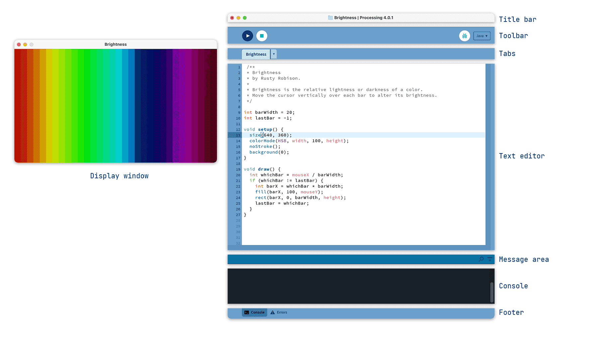

『Processingの公式ホームページから引用』

IDEの説明を聞いてもピンと来ないかもしれませんが,プログラミング講座で使った*Processing*というアプリも**IDE**の一種です。*Processing*はプログラミングでデジタルアートを作成することに特化した開発環境ですが,今回私たちが目標にしているのはマイコンの制御を行うことなのでマイコンに特化した**Arduino IDE 2**やSTM32 Cube IDEなどをIDEを準備する必要があります。今回の講座では機能がシンプルで直感的に扱うことのできるArduino IDE 2を使ってプログラムを書き込んで行きます。

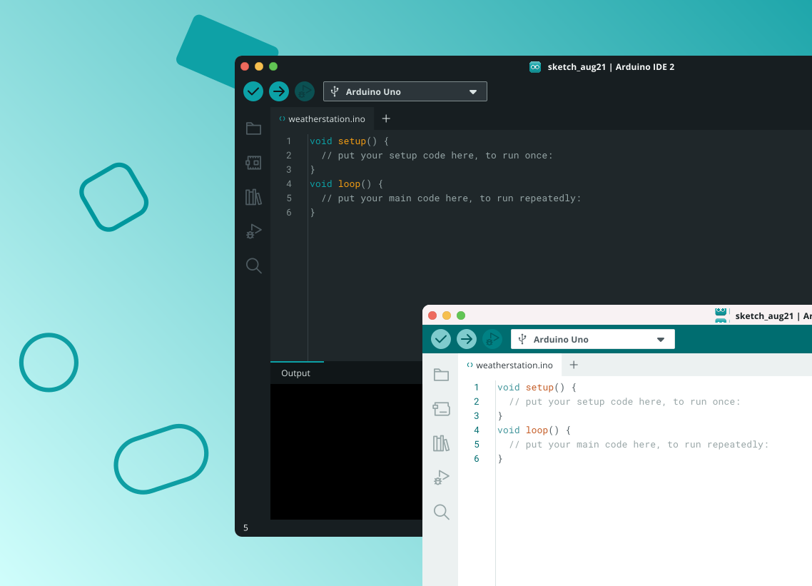

『Arduino IDEの公式ホームページから引用』

# 環境構築
**Arudino IDE 2**のインストール手順は複数ありますが,今回は一番簡単なMicrosoft Storeを使用する方法を紹介します。

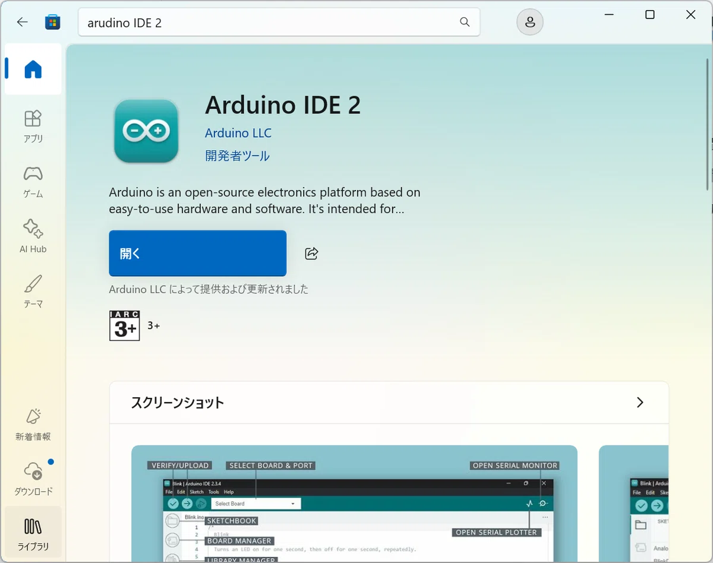

Microsoft Storeの検索バーに*Arduino IDE　2*と入力するとインストールボタンが出てくるのでダウンロードをして下さい。これでArduino IDE 2のインストール自体は完了します。インストールが完了するとインストールボタンが開くボタンに変更されます。開くボタンを押してIDEを起動してみましょう。もしSoftware Updateがきていたらdownloadをして下さい。

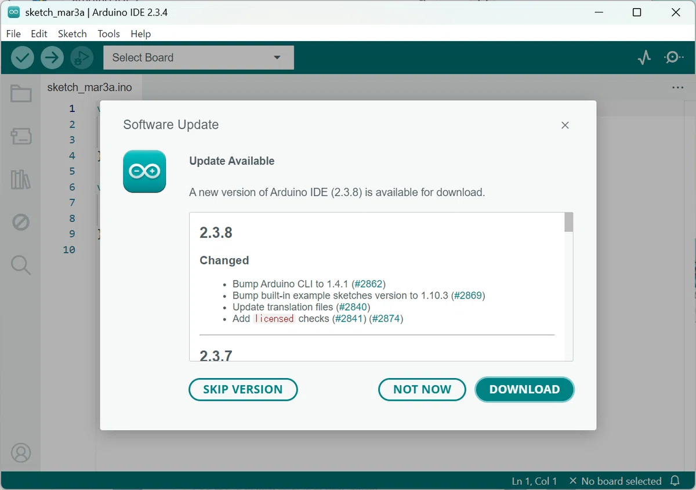

だたし、このIDEは本来Arduinoマイコンにプログラムを書き込む開発環境であるため、このままでは本講座で使用するESPマイコン(MH-ET LIVE MiniKit)にプログラムを書き込むことが出来ないため別途ドライバーインストールする必要があります。こちらの[リンク](https://www.silabs.com/software-and-tools/usb-to-uart-bridge-vcp-drivers?tab=downloads)からドライバーをダウンロードして下さい。

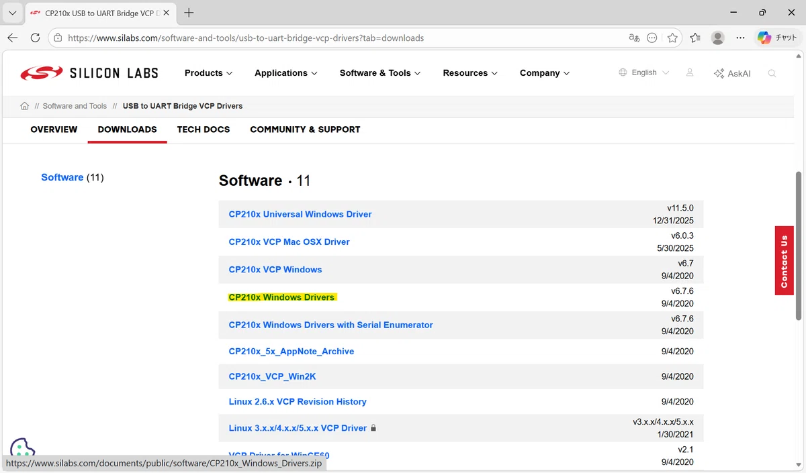

リンクをクリックするとスクリーンショットのようなページが出てきます。黄色マーカーで印を付けた**CP210x Windows Drivers**をダウンロードして、右クリックからすべて展開を選択してZIPを展開して下さい。

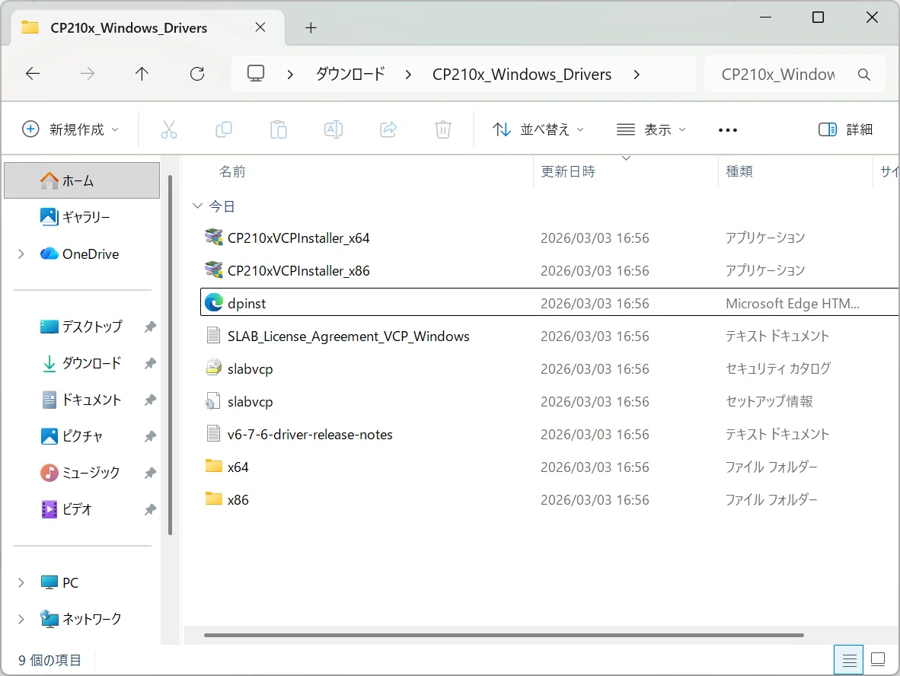

フォルダの中身を確認してみると上のスクリーンショットのようにx64とx86二つのアプリケーションが入っているのがわかると思います。x64とx86の違いは下の表にまとめた通りです。

| 項目         | x64 (64-bit)                         | x86 (32-bit)              |
|--------------|--------------------------------------|---------------------------|
| 最大メモリ   | 4GB以上 (理論上は16EB)               | 最大 4GB まで            |
| 処理能力     | 高い (大量データに最適)              | 普通 (軽量ソフト向け)    |
| OS互換性     | 32bitソフトも動作可能               | 64bitソフトは動作不可    |
| 普及時期     | 現代 (Windows 10 / 11)              | 過去 (Windows XP / 7)     |

windows11を使用している皆様はx64を選択します。上の表でごちゃごちゃと書いていますが、x64は新しい規格でx86とも互換性があるだなといったフワフワした認識で問題ないです。CP210xVCPInstaller_x64をクリックしてインストーラーを起動してください。

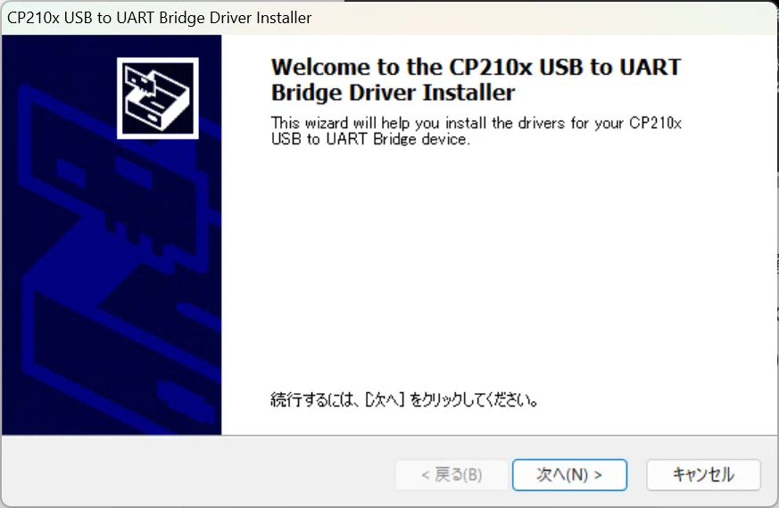

インストーラーの指示に従いドライバーを完了させて下さい。デバイス マネージャーからポートを確認してみると正常に認識しているのが分かるはずです。

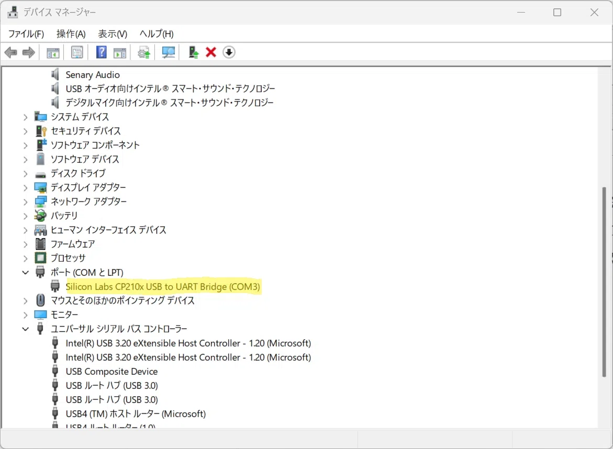

もし、デバイスが正常に認識されていなければ誤ったドライバーをインストールしている可能性があります。再度、記事を見直してください。

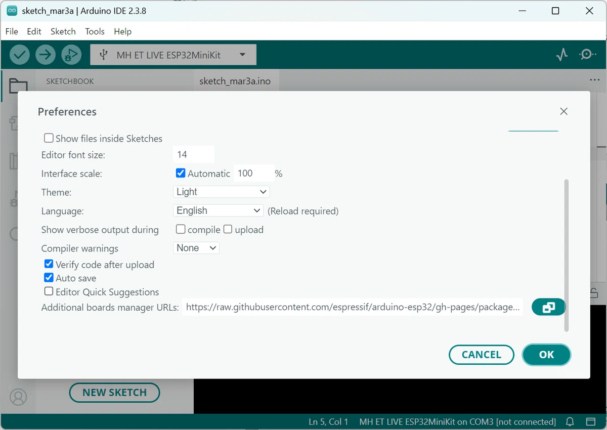

次の手順としてESPマイコンのボードをアプリ側に認識させるための設定を行います。上記の写真のようにFile->Preferencesのウィンドウを開き、Additional boards manager URLsに下記のリンクを入力し、OKを押してダウンロードして下さい。

※これをコピー：**https://raw.githubusercontent.com/espressif/arduino-esp32/gh-pages/package_esp32_index.json**

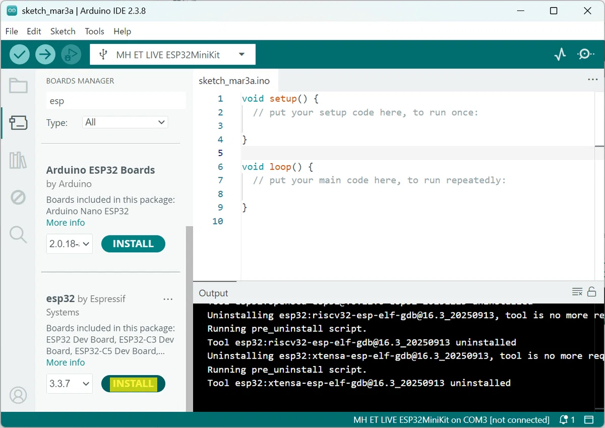

最後にアプリの左サイドボタンの上から2個目にあるBOARDS MANAGERをクリックし検索欄に**esp32 by Espressif Systems**と入力しINSTALLボタンを押せば晴れてセットアップは完了です。お疲れ様でした！

# おまけ
せっかく環境構築をしたのでマイコン(MH-ET LIVE MiniKit for ESP32)に搭載されているLEDチップを使った簡単なプログラムを実行してみます。Arduino IDE 2を起動して下記にあるコードをコピーして下さい。次にパソコンとESPマイコンを通信ケーブルで接続して下さい。
※充電ケーブルを使用してパソコンとマイコン間を接続した場合、コードの書き込みが失敗する可能性があるため注意して下さい。
マイコンとパソコンを通信用のケーブルで接続して下さい。充電用のケーブルを使用した場合、マイコンにうまくプログラムを書き込めない可能性があるので注意して下さい。最後にArduino　IDEを開いて以下のコードを張り付けてます。

```cpp
int LED_PIN = 2;// LEDのGPIOピンを保存する整数型の変数

void setup() {
  pinMode(LED_PIN, OUTPUT);// GPIOピンを出力に設定する処理
}

void loop() {
  digitalWrite(LED_PIN,HIGH);// GPIOピンの出力をONにする処理
  delay(1000);// 1秒間待つ処理
  digitalWrite(LED_PIN,LOW);// GPIOピンの出力をOFFにする処理
  delay(1000);// 1秒間待つ処理
}
```

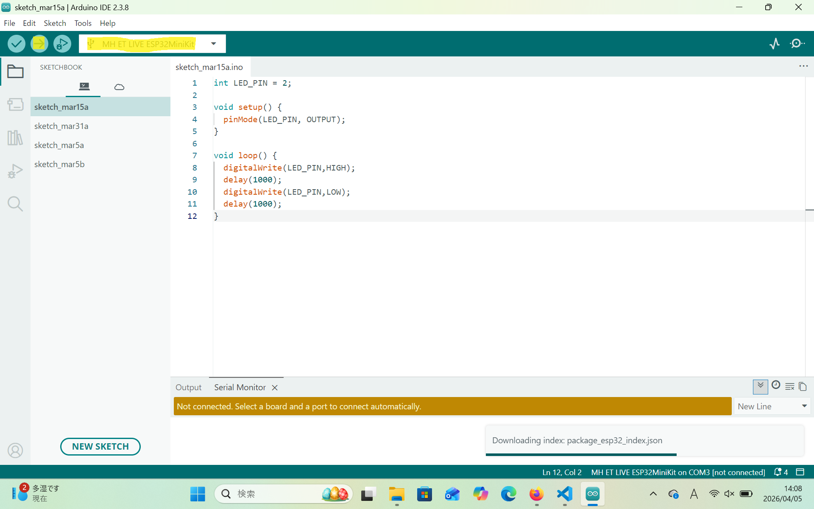

次に上部の青いツールバーの左側から四番目にあるプルダウン選択から**MH ET LIVE ESP32MiniKit**と書いてあるポートを選択して、最後に青いツールバーの左端から二番目にある➡ボタンを押すことで自動的にプログラムが機械語に翻訳されマイコン(ESP32MiniKit)に書き込まれます。書き込みが成功すると下記の写真のように内臓LEDが点滅を開始するはずです。

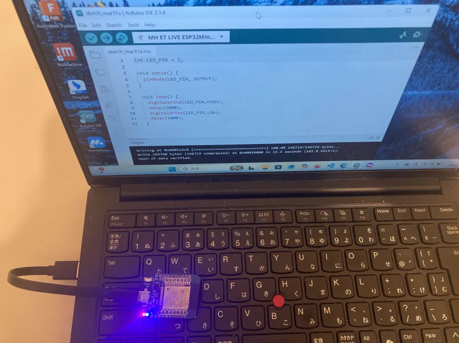

第一講座を受けていただきありがとうございまいした。これで皆さんのＰＣにもマイコン開発を行う環境を構築することが出来ました。次回は今回のコードをベースに複数のLEDを使って信号機🚥を再現するコードを書いて動かしてみましょう。