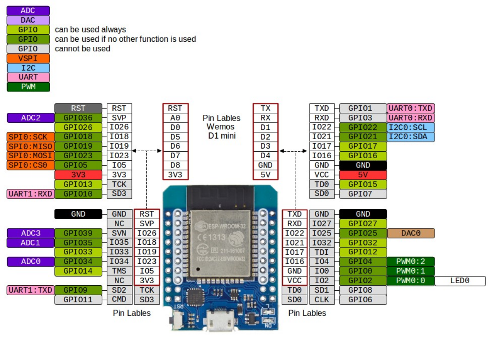

ESP32入門講座第2回:MH-ET LIVE MiniKit for ESP32で信号機を作ってみよう(Windows版) 
# はじめに


ESP32入門講座第二回は前回の告知通り、上記の写真のような信号機を制御するプログラムを書けるようになりましょう。以前、プログラミング講座で書いたfor文を思い出しながらコードを書いて見ましょう。

# 下準備
## 必要な部品リスト
はじめに下記の必要な部品リストに載っている機材を集めて下さい。
- Arduino IDE 2の入ったPC
- MH-ET LIVE MiniKit
- 信号機基盤
- 通信ケーブル(microB端子)

## 信号回路の確認と準備
[前回の記事](index.html?chapter=01_info)のおまけで、マイコンのGPIO2ピンをプログラムから指定してマイコン上のLEDを光らせていたと思います。ESP32やArduino、STMマイコンなどのマイコンには**GPIOピン**と呼ばれるピンがついています。GPIOピンを通してマイコンはタッチセンサーや光センサーなどの入力を受け取ったり、小さいモーターやLEDをコントロールすることが出来ます。今回は赤、黄、青のLEDをコントロールするためにGPIOピンを3つ使用します。


信号機の回路図は上記のようになっています。実際にプログラムを書く際のLEDとGPIOピンの番号は下記の表で示したとおりです。マイコンに書き込むプログラムを作成する際に参考にして下さい。

| LEDの色 | GPIOピン番号 |
|--------|--------------|
| RED | 15 |
| YELLOW | 16 |
| BLUE | 17 |

本来であれば、LEDだけの回路にも抵抗を使うべきですが、この講座では回路の簡略化のために抵抗を省いています(ただ抵抗を付けるのがめんどくさいだけ)。本講座では既に信号機用の回路の基板を作成してあるので、回路を作る必要はありません。下記の写真を参考にしながら、マイコンにユニバーサル基板を差し込んで下さい。これにて信号機の回路準備は完了です。


## Arduino言語の基礎
皆さんに馴染みのあるProcessingはJavaというプログラミング言語を元にしていますが、Arduino IDE　2で使われているArduino言語はC++が元になっているので若干書き方に違いがあります。ここではマイコンのプログラムを書くにあたって最低限知っていて欲しい二つの関数について紹介します。一つ目は初期化関数の```void setup()```です。この関数は名前の通りマイコンに電源が入ってから一度だけ呼び出される関数です。主にマイコンのGPIOピンの初期設定や各種変数の初期化などの目的で使用されます。下記のコードでsetup関数を用いてGPIOピンの2ピンを出力ピンに設定する処理を示します。

```cpp
int LED_PIN = 2;// GPIOピンの番号を指定するint型変数
void setup(){
    pinMode(LED_PIN, OUTPUT);// GPIOピンの入出力を設定する処理
}
```

二つ目はメイン処理関数の```void loop()```です。この関数はマイコンに電源が入っている間、繰り返し実行され続ける関数です。ロボットの動作制御やセンサーの読み取りなど、実際にやりたい処理をここに書きます。ただし「一定間隔で実行」されるわけではなく、前の処理が終わり次第すぐに次のループが始まる点に注意してください。下記のコードで loop() 関数を用いてGPIOピン2番のLEDを1秒ごとに点滅させる処理を示します。

```cpp
int LED_PIN = 2;

void setup() {
    pinMode(LED_PIN, OUTPUT);
}

void loop() {
    digitalWrite(LED_PIN, HIGH); // LEDを点灯
    delay(1000);                 // 1秒待機
    digitalWrite(LED_PIN, LOW);  // LEDを消灯
    delay(1000);                 // 1秒待機
}
```

# LEDを光らせてみよう(レベル1)
「信号回路の確認と準備」と「Arduino言語の基礎」を参考に実際の信号機を真似て青色→黄色(点滅)→赤色のような動きを作って見ましょう。for文を使わずに実装してください。下記に完成形のコードを書きましたので、**一度自分で書いてから**に確認してみて下さい。

**ワンポイントアドバイス**:自分で書いたコードには簡単でいいので*コメント*を書くようにしましょう。信号機をコントロールする程度のプログラムならコメントを、CANSATとかの中規模の開発になってくるとぱっと見で何をしている処理なのか分からなくて無駄な時間がかかってしまう。自分で書いたプログラムをその時に理解していても、一か月後には忘れているかもしれない。いまのうちから後から見返しやすいコードを書く癖をつけると今後の開発で役に立つよ！

```cpp:hide
// GPIOピンの番号を指定するint型変数
int BLUE = 17;
int YELLOW = 16;
int RED = 15;

void setup() {
  // GPIOピンを出力ピンに出力する処理
  pinMode(BLUE, OUTPUT);
  pinMode(YELLOW, OUTPUT);
  pinMode(RED, OUTPUT);
}

void loop() {
  // 青色LEDピンだけを点灯させる処理
  digitalWrite(RED, LOW);
  digitalWrite(BLUE, HIGH);
  delay(1000);
  // 黄色LEDピンだけを点滅させるする処理
  digitalWrite(BLUE, LOW);
  digitalWrite(YELLOW, HIGH);
  delay(1000);
  digitalWrite(YELLOW, LOW);
  delay(1000);
  digitalWrite(YELLOW, HIGH);
  delay(1000);
  digitalWrite(YELLOW, LOW);
  delay(1000);
  digitalWrite(YELLOW, HIGH);
  delay(1000);
  // 赤色LEDピンだけを点灯させる処理
  digitalWrite(YELLOW, LOW);
  digitalWrite(RED, HIGH);
  delay(1000);
}
```

# for文を使って点滅を再現してみよう(レベル2)
無事に信号機を動作させることは出来ましたね。ただ例示したコードこのままでは黄色LEDピンを点滅させる処理で同じ内容が何度も書かれていてくどいですよね。そこでProcessing講座でも使ったfor文を使ってコードを短くしてみましょう。下記にfor文書き方を載せていますのでこれを用いてレベル1のコードを改造してみましょう。

```cpp
for(int i=0; i<3; i++){// カッコ内の処理を3回処理
    
}
```

```cpp:hide
// GPIOピンの番号を指定するint型変数
int BLUE = 17;
int YELLOW = 16;
int RED = 15;

void setup() {
  // GPIOピンを出力ピンに出力する処理
  pinMode(BLUE, OUTPUT);
  pinMode(YELLOW, OUTPUT);
  pinMode(RED, OUTPUT);
}

void loop() {
  // 青色LEDピンだけを点灯させる処理
  digitalWrite(BLUE, HIGH);
  delay(1000);
  digitalWrite(BLUE, LOW);
  // 黄色LEDピンだけを点滅させる処理
  for(int i=0; i<3; i++){
    digitalWrite(YELLOW, HIGH);
    delay(1000);
    digitalWrite(YELLOW, LOW);
    delay(1000);
  }
  // 赤色LEDピンだけを点灯させる処理  
  digitalWrite(RED, HIGH);
  delay(1000);
  digitalWrite(RED, LOW);
}
```
# 関数を使って処理をまとめてみよう(レベル3)
レベル2の実装例を読んでみて気づいたことはあるかな？実は、黄色LEDを制御するために書かれたfor文の内部処理の内容は青色、赤色LEDを点灯させるコードはほとんど一緒なんです。これよく考えたら同じ処理を何回も書くのは効率が悪いんです。君たちもそう思うよね(無言の圧力(￣ー￣)。

**ワンポイントアドバイス**:自分の書いたコードには簡単でいいので*コメント*を書いて下さい。今回の信号機制御程度のプログラムであればコメントが無くてもすぐ理解できる。ただ、マルチコプターやCANSATなどの開発をするとコード全体で一万行になってしまうこともあるのに、コメントが無ければ新しい機能の追加やバグの修正をするときに有り得ないほど時間がかかってしまいます。その時、理解していても一か月後には忘れているかもしれない。いまのうちから処理にコメントをこまめに書く癖をつけると今後の開発で役に立ちます。

```cpp
// 青色LEDピンだけを点灯させる処理
digitalWrite(BLUE, HIGH);
delay(1000);
digitalWrite(BLUE, LOW);

// 黄色LEDピンだけを点滅させる処理
digitalWrite(YELLOW, HIGH);
delay(1000);
digitalWrite(YELLOW, LOW);
delay(1000);

// 赤色LEDピンだけを点灯させる処理  
digitalWrite(RED, HIGH);
delay(1000);
digitalWrite(RED, LOW);
```

上記のコードはレベル2のGPIO制御だけを抜き出したものだけど、どのLEDをコントロールするプログラムもほとんど同じ処理しかしてないのが分かります。何回も処理を繰り返すのはめんどくさいよね(無言の圧力。
ここで登場するのがさっきからちょこちょこ出てきてる関数という概念です。これまでに```digitalWrite()```や```delay()```などの関数を使ってきたと思いますが、実は自分で新しい関数を定義することが出来ます。ここで軽く**関数**について説明すると、よく使う処理を一つの塊にして再利用できる便利な機能ということになりますが、実際にコードを書いた方が理解が深まると思いますので黄色LEDを点滅させる処理、```LED_BLink()```関数を作ってみましょう。

**ワンポイントアドバイス**:関数には引数という概念があり、これを使うことで処理に必要な情報を関数に伝達することが出来ます。例えば、今回の```LED_BLink()```関数ではGPIOの何番ピンを出力に使うべきなのか、何回点滅して欲しいのかなどの情報がない処理する側は困ってしまいますよね。引数は変数の型と変数名をカンマ区切りで宣言することが出来ます。

下記の```LED_BLink()```関数を書き直し、使える任意のLEDを任意の回数だけ点滅できるコードに変更して下さい。

```cpp
// GPIOピンの番号を指定するint型変数
int BLUE = 17;
int YELLOW = 16;
int RED = 15;

void LED_BLink(int pin_number,int repeat_count){
  // ここに黄色LEDを点灯させる処理を記述
}

void setup() {
  // GPIOピンを出力ピンに出力する処理
  pinMode(BLUE, OUTPUT);
  pinMode(YELLOW, OUTPUT);
  pinMode(RED, OUTPUT);
}

void loop() {
  // 青色LEDピンだけを点灯させる処理
  digitalWrite(BLUE, HIGH);
  delay(1000);
  digitalWrite(BLUE, LOW);
  // 黄色LEDピンだけを点滅させる処理
  LED_BLink(YELLOW, 3);
  // 赤色LEDピンだけを点灯させる処理  
  digitalWrite(RED, HIGH);
  delay(1000);
  digitalWrite(RED, LOW);
}
```
↓コード例
```cpp:hide
// GPIOピンの番号を指定するint型変数
int BLUE = 17;
int YELLOW = 16;
int RED = 15;

// 任意のLEDを点滅させる関数
void LED_Blink(int pin_number, int repeat_count){
    for(int i=0; i<repeat_count; i++){
        digitalWrite(pin_number, HIGH);
        delay(1000);
        digitalWrite(pin_number, LOW);
        delay(1000);
    }
}

void setup() {
  // GPIOピンを出力ピンに出力する処理
  pinMode(BLUE, OUTPUT);
  pinMode(YELLOW, OUTPUT);
  pinMode(RED, OUTPUT);
}

void loop() {
  // 青色LEDピンだけを点灯させる処理
  digitalWrite(BLUE, HIGH);
  delay(1000);
  digitalWrite(BLUE, LOW);
  // 黄色LEDピンだけを点滅させる処理
  LED_BLink(YELLOW, OUTPUT);
  // 赤色LEDピンだけを点灯させる処理  
  digitalWrite(RED, HIGH);
  delay(1000);
  digitalWrite(RED, LOW);
}
```
コード例と同じようになっていなくても動いていれば気にしなくて大丈夫です。次は```LED_Blink()```関数に点滅時間を制御できる機能を追加し、青や赤の点灯処理も```LED_Blink()```関数を使って記述してみましょう。追加の引数名はint型の```on_time```と```off_time```を使うといいと思います。

**ワンポイントアドバイス**:関数は設定した引数と同じだけ変数を渡してあげないエラーが出るため注意してください。

```cpp:hide
// GPIOピンの番号を指定するint型変数
int BLUE = 17;
int YELLOW = 16;
int RED = 15;

// 任意のLEDを点滅させる関数
void LED_Blink(int pin_number, int repeat_count, int on_time, int off_time){
    for(int i=0; i<repeat_count; i++){
        digitalWrite(pin_number, HIGH);
        delay(on_time);
        digitalWrite(pin_number, LOW);
        delay(off_time);
    }
}

void setup() {
  // GPIOピンを出力ピンに出力する処理
  pinMode(BLUE, OUTPUT);
  pinMode(YELLOW, OUTPUT);
  pinMode(RED, OUTPUT);
}

void loop() {
  LED_Blink(BLUE,1,1000,0);  // 青色LEDピンだけを点灯させる処理
  LED_Blink(YELLOW,3,1000,1000);  // 黄色LEDピンだけを点滅させる処理
  LED_Blink(RED,1,1000,0); // 黄色LEDピンだけを点灯させる処理
}
```
これにてchapter_02のプログラミングは完了です。```LED_Blink()```関数の引数をいじってリアルな信号機の動作を追求してみてみて下さい。
# おまけ(マイコンの仕様書を見てみよう)
今回は本講座で使用しているマイコン「MH-ET LIVE MiniKit」のピン配置の仕様書を軽く眺めて見ましょう。


このピン配置図と配線を見ることでどのGPIOピンを有効化するべきなのか分かるようになっています。たとえばこのマイコンで内臓のLEDチップを光らせたいとしましょう。配置図をじっくり観察してみると右下の端にLED0がGPIOピンの2番ピンに繋がっていることが書かれています。最後までご覧頂きありがとうございました。次回はサーボモータの制御やLEDの明るさを調整することのできるPWM制御について学んで行きましょう。