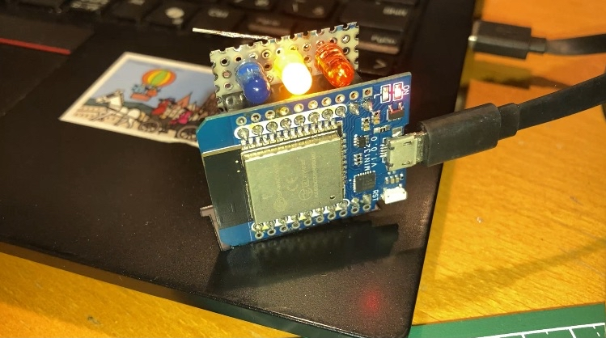
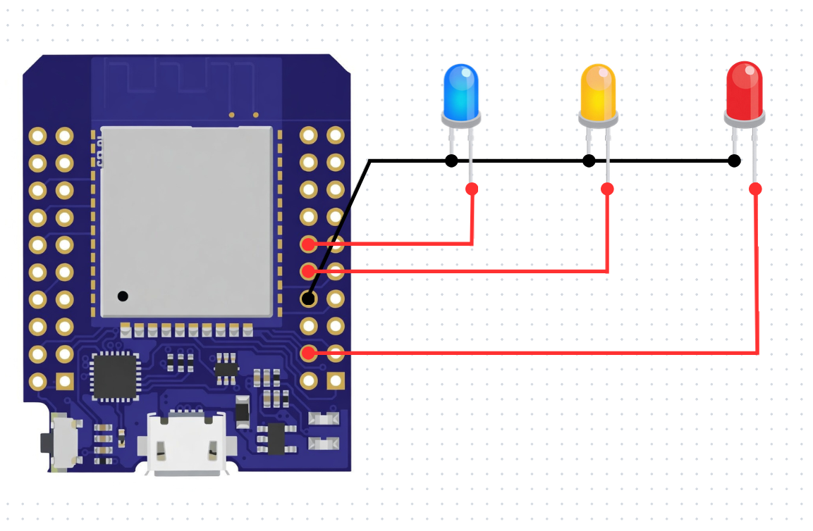
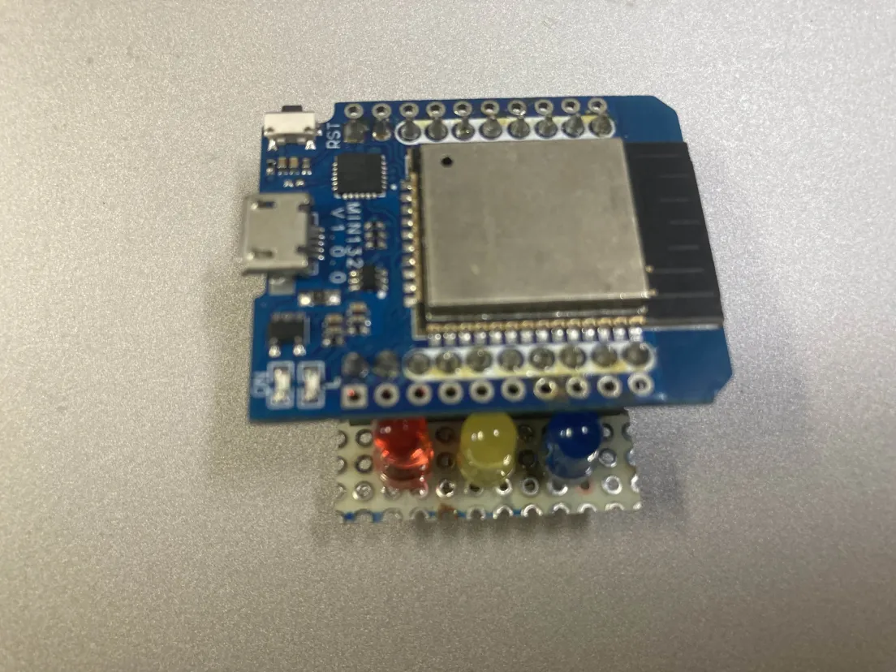

ESP32入門講座第2回:MH-ET LIVE MiniKit for ESP32で信号機を作ってみよう(Windows版) 
# はじめに


ESP32入門講座第二回は前回の告知通り、上記の写真のような信号機を制御するプログラムを書いて動かせるようになって貰います。以前のプログラミング講座で使ったようなfor文を思い出しながらコードを書いて見ましょう。

# 下準備
## 必要な部品リスト
はじめに下記の必要な部品リストに載っている機材を集めて下さい。
- Arduino IDE 2の入ったPC
- MH-ET LIVE MiniKit
- 信号機基盤
- 通信ケーブル(microB端子)

## 信号回路の確認と準備
[前回の記事](index.html?chapter=01_info)のおまけではマイコンの2番ピンをプログラムで指定して内臓のLEDを光らせていたと思います。ESP32やArduino、STMマイコンなどのマイコンには**GPIOピン**と呼ばれるピンがついています。このピンを通してマイコンはタッチセンサーや光センサーなどの入力を受け取ったり、小さいモーターやLEDに電流を流し、動かしたり、光らせたりすることが出来ます。今回は赤、黄、青のLEDをコントロールするためにGPIOピンを3つ使用します。


信号機の回路図は上記のようになっています。実際にプログラムを書く際のLEDとGPIOピンの番号は下記の表で示したとおりです。実際にこれからプログラムを書くときの参考にして下さい。

| LEDの色 | GPIOピン番号 |
|--------|--------------|
| RED | 15 |
| YELLOW | 16 |
| BLUE | 17 |

本来であればLEDを使った回路にも抵抗を使うべきですがこの講座では回路の簡略化のために抵抗を省いています(ただ抵抗を付け忘れただけ)。今回は既に信号機用の回路の基板を作成してあるので、回路を作る必要はありません。下記の写真を参考にしながら、マイコンにユニバーサル基板を差し込んで下さい。これにて信号機の回路準備は完了です。



## Arduino言語の基礎
皆さんに多少馴染みProcessingはJavaというプログラミング言語を元にしていますが、Arduino IDEで使われているArduino言語はC++が元になっているので若干書き方に違いがあります。ここではマイコンのプログラムを書くにあたって最低限知っていて欲しい二つの関数について紹介します。一つ目は初期化関数の```void setup()```です。この関数は名前の通りマイコンに電源が入ってから一度だけ呼び出される関数です。主にマイコンのGPIOピンの初期設定や各種変数の初期化などの目的で使用されます。二つ目は

# 好きなLEDを光らせてみよう(レベル1)
前回の[ESP32講座](?chapter=01_info)で少し触れましたが、マイコンでLEDを光らせるためには使いたいGPIOピンを設定します。

```cpp
{
    pinMode(LED_PIN, OUTPUT);// GPIOピンを出力に設定する処理
}
```

# 信号機🚥のコードを書いてみよう(レベル2)

# おまけ
マイコンの仕様書を見てみよう
