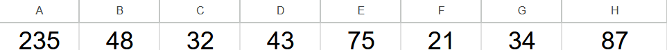
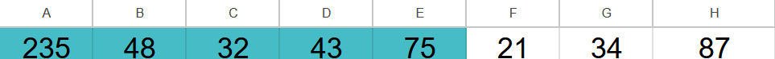

ESP32入門講座第3回:MH-ET LIVE MiniKit for ESP32で自動投下装置を作ろうchapter:1(Windows版) 
# はじめに
前回の予告通り、今回のESP32基本講座ではサーボモータの制御方法について学んで行きましょう。サーボモータとは位置や角度を正確にコントロール出来る便利なモータです。サーボモータのような可動部品を扱えるようになると電子工作で出来ることの幅が一気に広がります。nokolatでも、サーボモータを飛行機やマルチコプター(ドローン)に搭載されている自動投下装置、CANSATで使用するパラシュート切り離し機構など様々な機構で活用しています。


# 下準備
## 必要な部品リスト
はじめに下記の必要な部品リストに載っている機材を集めて下さい。
- Arduino IDE 2の入ったPC
- MH-ET LIVE MiniKit
- 通信ケーブル(microB端子)
- 青色小型サーボモータ(ESP32入門講座ボックスに入っているはず)
## サーボモータ制御回路の確認と準備


サーボモータでPWM制御を行うにはGND・電源(5V~3.2V)・信号線の三本線が必要です。配線の色は慣例で、黄色線が信号線(GPIO)・赤色線が(5V)・茶色又黒色が(GND)に対応しています。今回は上記の回路図と同じように配線をして下さい。この回路図ではワイヤーを経由してマイコンと接続していますが、マイコン(ESP32)のピンとコネクタは直接接続して問題ありません。

**ワンポイントアドバイス**:配線を間違えるとサーボモータやマイコンが壊れてしまう可能があるので、電源を入れる前に必ず**配線のダブルチェック**を行いましょう。

## サーボモータを制御の仕組み
前述の通り、サーボモータは精密な角度制御が可能な電子部品ですが、どのような仕組みで角度を制御しているのかご存知ですか。実はPWMというけっこうシンプルな信号方式を使用してコントロールされています。PWM制御はPulth Width Modulation(パルス幅変調)の略で、パルス信号(僅かな時間だけ出力がオンになる信号)を活用した制御方式です。また、このPWM信号には"信号がオンの時間÷信号の周期"で定義されているデューティ比という重要な概念があります。


上記の図に引かれている点線はこの信号の平均値を表しています。例えばデューティ比75%であれば、パルス一周期の4分の3はオン、4分の1はオフになっており平均すると出力が0.75になることが確認できると思います。この原理はサーボモータの制御以外に降圧回路などにも応用されており、同様にデューティ比を変化させることでLEDの明るさを滑らかに調整することも可能です。

**ワンポイントアドバイス**:一般的にサーボモータで使われるPWM信号の周期は20ms（0.02秒）で、角度はデューティ比ではなくパルス幅によって決まります（結果としてデューティ比も変化しますが）。多くの場合、約1.0ms〜2.0msのパルス幅が0〜180度に対応しています。

# サーボモータを動かしてみよう(その1)
サーボモータの仕組みと配線が終わったので取り敢えず、動かして動かしてみましょう。先ほど説明した仕組みを使いパルス信号を生成するコードから書いても良いのですが、今回は時間を節約するために、既にサーボモータをコントロールするライブラリを活用します(やりたい方はライブラリを使わずに実装しても構いません！)。

はじめにPCとマイコンを通信ケーブルで接続してPC上で認識されているか確認して下さい。

**ワンポイントアドバイス**:ESP32を使うためには別途Arduino IDEの設定を変更する必要があります。パソコンからESPが認識されない場合は本講座の[第一回](?chapter=01_info)を参照して設定を見直してみて下さい。

その後Arduino IDEを起動して下さい。


起動が完了したら、サーボモータを制御するためにライブラリをインストールします。IDEの左側のツールバーの上から三番にある本のアイコンをクリックすると上記のような画面が開けます。LIIBRARY MANAGERの下にある検索欄に"esp32servo"すると一番上に出てくる**ESP32Servo** by Kevinと書かれたライブラリをINSTALLボタンを押してください。インストールが完了したら下記のコードをコピペしてコンパイルボタンを押して下さい。
```cpp
#include <ESP32Servo.h>//ライブラリをインクルードする処理

Servo servo_moter;//サーボを制御するインスタンス作成処理
void setup() {
  servo_moter.attach(15);//サーボのピン番号を15ピンに設定する処理
}

void loop() {
  servo_moter.write(0);//サーボの目標角を0度に設定する処理
  delay(1000);
  servo_moter.write(180);//サーボの目標角を180度に設定する処理
  delay(1000);
}
```
コンパイルが成功するとモーターが1秒が前後に動き出していれば成功です。

ここで少しコード内で登場した新しい処理についてかいつまんで説明します。
```cpp
#include <ESP32Servo.h>
```
コードの先頭の処理は外部のライブラリ(頻繁に使う処理をまとめて使いやすくした物)を自分のコード内に取り込むための処理です。この処理が抜けていると```Servo```のようなarduino IDEにデフォルトで入っていない機能を使用することが出来ません。一口にライブラリと言っても様々なものがあり、WiFiの通信を可能にするWiFi.hやESP32上で簡易的なWEBサーバーを構築出来るHTTPClient.hなどがあります。
```cpp
Servo servo_moter;
```

この処理ではServoインスタンスを作成しています。インスタンスとは、ざっくりいうと**サーボモータを操作するための関数をひとまとめにした道具箱**のようなものです。作成したインスタンスの後ろに```.```を付けることで道具箱の中に入っている工具(関数)を使用できます。例えば、ピン番号を設定する```attach```関数やサーボモータの角度を指定する```write```を使うときは以下のように書くことが出来ます。
```cpp
servo_moter.attach(15);
servo_moter.write(180);
```
実はインスタンスを複数作成することが出来ます。
```cpp
Servo servo_moter1;
Servo servo_moter2;
```
このようにライブラリとインスタンスを活用することで比較的簡単にサーボモータを制御が可能になります。

# サーボモータを動かしてみよう(その2)
これまでの章では、サーボモータの動かし方やインスタンスについて軽く触れてきました。ここではProcessing講座でも出てきた配列の機能を使ってサーボモータの制御を書くことに挑戦してみましょう。
## 配列の基礎知識


Processing講座で上図のような雨粒が落ちてくるアニメーションを作成したことを覚えていますか？

この複数の雨粒を同時に動かすために以下のような**配列**を作成したかと思います。
```
int[] x,y;//すべての雨粒の位置を管理するための配列
```
ここで配列を使ったとき”複数の値を保存できる変数の列”というざっくりとした説明に留めていましたが、今回はもう少し配列の概念を細かく説明します。

**ワンポイントアドバイス**:上記のコードはProcessing(Java)の書き方で、Arduino(cpp)では異なる書き方なので注意して下さい。

私たちが書いたプログラムが動くとき、メモリ(作業台)上に実行すべき命令や変数・配列などのデータが展開されます。メモリのひとつひとつにはアドレス(そのメモリにアクセスするための住所)が割り振られており、プログラム実行直後はそれぞれのアドレスに以前の処理で使われた値がそのまま残っています。



Arduino言語(cpp)においての配列は上図のようなメモリから連続して確保されたメモリ領域のことを指しています。試しにint型で要素数が5つ持つ配列を作ってみましょう。
```cpp
int sample[5];
```
この命令を実行するとメモリの状態は下記のようになります。


青色に塗られた部分のメモリを配列```sample```用に確保(他の処理で勝手にメモリが使われなくなる)されます。ただ、確保しただけではメモリに格納されている値は変わらないため使用する前に初期化する必要があります。初期化するときは
```cpp
int sample[5] = {1,2,3,4,5};
```
のように配列の要素数を明示的に書く方法と
```cpp
int sample[] = {1,2,3,4,5};
```
配列の要素を書かずに要素だけを波カッコで括る方法があります。こちらの方法の場合はコンパイラー(コンピュータが実行)が書かれている要素の数を数えて必要な分だけメモリを自動で確保してくれます。このように初期値まで設定されるとメモリの状態は下記のようになります。


ここではアドレスにアルファベットが割り当てられていますが、ここはあくまでもイメージですのでご注意ください。配列の長所はなんといっても簡単に値が取り出せることです例えば先頭の値1を取り出すには
```cpp
sample[0]
```
とすると出力を得ることが出来ます。先頭のindexは0から始まるため、sample配列の最後のindexは4になります。繰り返しになりますが、配列において重要な点はメモリ上に**連続**に並んでいることです。連続が並べているため、アドレスやインデックスを隣にずらしていくだけで簡単にsampleの中の要素をfor文やwhile文などで要素を取り出すことが可能です。

さてそれでは、これまでに習った```for文```・```インスタンス```・```配列```などの機能をを使って一秒ごとに0度、180度、90度、0度、90度に行ったり来たりするコードを書いてみてください。

**ワンポイントアドバイス**：変数を使って配列のサイズを指定する場合は const int を使う必要があります。通常の int 変数は実行時まで値が確定しないため、コンパイル時にメモリをいくつ確保すればいいか判断できずエラーになります。const を付けることでコンパイル時に値が確定するため、サイズの指定に使えるようになります。

サーボモータが想定通りに動けばひとまずは成功です。

もしコードをが思う通りに動かなかった場合は
↓下記のトグルをクリックして下さい、サンプルコードを載せてあります。

```cpp:hide
#include <ESP32Servo.h>//ライブラリをインクルードする処理

Servo servo_moter;//サーボを制御するインスタンス作成処理
const int arr_size = 5;//
int moter_position[arr_size] = {0, 180, 90, 0, 90};//モータモータの目標角度を保存する配列
void setup() {
  servo_moter.attach(15);//サーボのピン番号を15ピンに設定する処理
}

void loop() {
    for(int i=0; i<arr_size; i++){//ループ文を使いサーボを指定された角度通りに動作させる処理
        servo_moter.write(moter_position[i]);
        delay(1000);
    }
}
```

お疲れ様です、これにて第三回ESP32入門講座は終了です。次回はデバックやセンサーの読み取りなどに役立つシリアル通信について学びます。