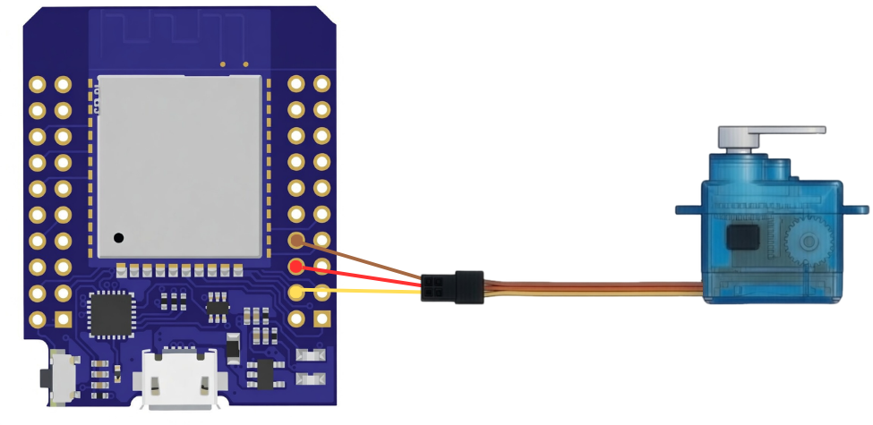
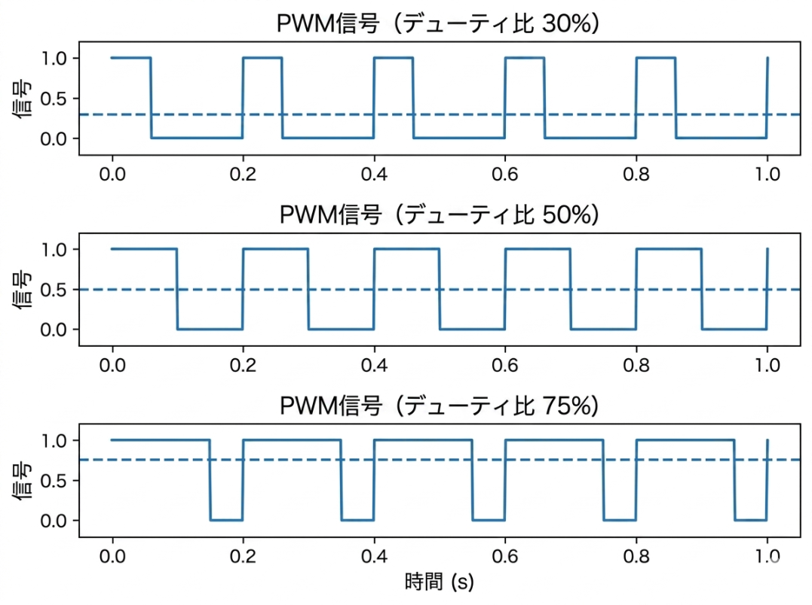
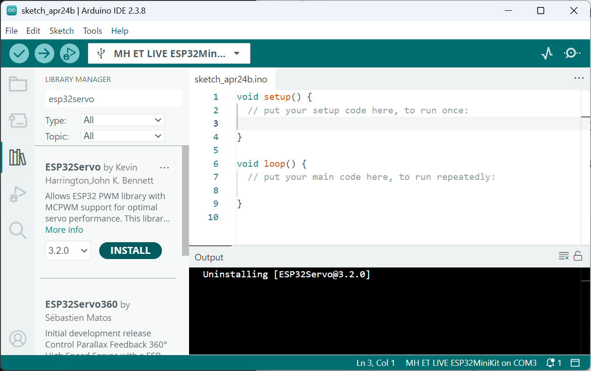

ESP32入門講座第3回:MH-ET LIVE MiniKit for ESP32で自動投下装置を作ろうchapter:1(Windows版) 
# はじめに
前回の予告通り、今回のESP32基本講座ではサーボモータの制御方法について学んで行きましょう。サーボモータとは位置や角度を正確にコントロール出来る便利なモータです。サーボモータのような可動部品を扱えるようになると電子工作で出来ることの幅が一気に広がります。nokolatでも、サーボモータを飛行機やマルチコプター(ドローン)に搭載されている自動投下装置、CANSATで使用するパラシュート切り離し機構など様々な機構で活用しています。

# 下準備
## 必要な部品リスト
はじめに下記の必要な部品リストに載っている機材を集めて下さい。
- Arduino IDE 2の入ったPC
- MH-ET LIVE MiniKit
- 通信ケーブル(microB端子)
- 青色小型サーボモータ(ESP32入門講座ボックスに入っているはず)
## サーボモータ制御回路の確認と準備

サーボモータでPWM制御を行うにはGND・電源(5V~3.2V)・信号線の三本線が必要です。配線の色は慣例で、黄色線が信号線(GPIO)・赤色線が(5V)・茶色又黒色が(GND)に対応しています。今回は上記の回路図と同じように配線をして下さい。この回路図ではワイヤーを経由してマイコンと接続していますが、マイコン(ESP32)のピンとコネクタは直接接続して問題ありません。

**ワンポイントアドバイス**:配線を間違えるとサーボモータやマイコンが壊れてしまう可能があるので、電源を入れる前に必ず**配線のダブルチェック**を行いましょう。

## サーボモータを制御の仕組み
前述の通り、サーボモータは精密な角度制御が可能な電子部品ですが、どのような仕組みで角度を制御しているのかご存知ですか。実はPWMというけっこうシンプルな信号方式を使用してコントロールされています。PWM制御はPulth Width Modulation(パルス幅変調)の略で、パルス信号(僅かな時間だけ出力がオンになる信号)を活用した制御方式です。また、このPWM信号には"信号がオンの時間÷信号の周期"で定義されているデューティ比という重要な概念があります。

上記の図に引かれている点線はこの信号の平均値を表しています。例えばデューティ比75%であれば、パルス一周期の4分の3はオン、4分の1はオフになっており平均すると出力が0.75になることが確認できると思います。この原理はサーボモータの制御以外に降圧回路などにも応用されており、同様にデューティ比を変化させることでLEDの明るさを滑らかに調整することも可能です。

**ワンポイントアドバイス**:一般的にサーボモータで使われるPWM信号の周期は20ms（0.02秒）で、角度はデューティ比ではなくパルス幅によって決まります（結果としてデューティ比も変化しますが）。多くの場合、約1.0ms〜2.0msのパルス幅が0〜180度に対応しています。

# サーボモータを動かしてみよう(その1)
サーボモータの仕組みと配線が終わったので取り敢えず、動かして動かしてみましょう。先ほど説明した仕組みを使いパルス信号を生成するコードから書いても良いのですが、今回は時間を節約するために、既にサーボモータをコントロールするライブラリを活用します(やりたい方はライブラリを使わずに実装しても構いません！)。

はじめにArduino IDEを起動して下さい。

**ワンポイントアドバイス**:ESP32を使うためには別途Arduino IDEの設定を変更する必要があります。パソコンからESPが認識されない場合は本講座の[第一回](?chapter=01_info)を参照して設定を見直してみて下さい。

起動が完了したら、サーボモータを制御するためにライブラリをインストールします。IDEの左側のツールバーの上から三番にある本のアイコンをクリックすると上記のような画面になると思います。LIIBRARY MANAGERの下にある検索欄に"esp32servo"すると一番上に出てくる**ESP32Servo** by Kevinと書かれたライブラリをインストールしてください。